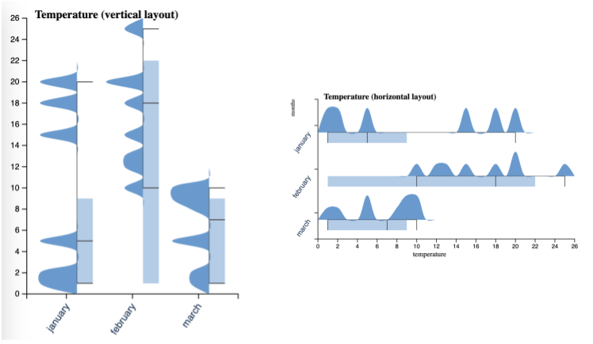

## Ridges.js

> A JavaScript library for generating ridgeline plots, providing options for both **horizontal** and **vertical** layouts. 

This library combines the features of box plots and ridgeline plots into a unified visualization for each group. To use this library effectively, your input data should include summarized metrics.



Install the package from [npm](https://www.npmjs.com/package/ridges.js),

```bash
npm install ridges.js
```

To begin using Ridges.js, follow these steps:

1. Choose your preferred layout, either horizontal or vertical.
2. Instantiate a new visualization object.
3. Customize the visualization by configuring properties such as titles, selected metrics, the number of ticks, and more.
4. Provide your data.
5. Render the plot in your desired dimensions.

Here's an example:

```js
import { VerticalRidgePlot, HorizontalRidgePlot } from "ridges.js";
import { data } from "./app/data.js";

let vridge = new VerticalRidgePlot(".ridgeline-vertical");
vridge.setState({
    title: "Temperature (vertical layout)",
    xLabel: "months",
    yLabel: "temperature",
    metric: "mean",
    gradient: false
});

vridge.setInput(data);
vridge.render(300, 500);
```

### Data model

The data object is expected to contain **groups** as keys, and each `group` should have metrics for visualizing the boxes and ridges. Here's an example:

```js
const data = {
  january: {
    min: 1,
    max: 20,
    mean: 10,
    median: 5,
    quantiles: [1, 5, 9, 10], // box plot metrics
    values: [1, 2, 5, 20, 15, 18], // for the histogram
  }
}
```

Check out more examples in the [app directory](./app/)!

